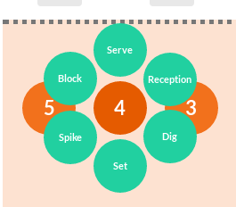

# AWA1 - Doc

## Context

Pour le cours d'AWA1, il a fallu mettre en place des animations de notre choix sur un projet personnel.
Dans mon cas, j'ai utilisé l'app **SCOUT** qui sers a saisir les données d'un match de volley ball.

J'ai voulu faire un composant qui serait utile pour aider la saisie quand on utilise l'app en version tactile en affichant des boutons autour du bouton clicker.



## Fichiers utilisé pour le projet

* `src/pages/operator.jsx` : point d'entrée pour l'affichage (la page)
* `src/components/operator.jsx` : Composant d'affichage d'un court
* `src/components/btnGrow.jsx` : Composant logique utilisé pour géré l'affichage des boutons de manière circulaire

## Technos utilisées

* [react](https://www.npmjs.com/package/react)
* [react-move](https://www.npmjs.com/package/react-move)

## Documentation du bouton

### Exemple

```js
import GrowBtn from './components/btnGrow.jsx'
// [...]
 <GrowBtn
  btnColor="#21d0a0"
  iconColor="white"
  d={diameterOfButton()}
  subButtons={[{elem:<div>Bouton1</div>,click:actionHandler},{elem:<div>Bouton2</div>,click:actionHandler},/*[...]*/]}
/>
```

### Propriétés

* `btnColor` : couleur css utilisé pour la couleur de fond des boutons
* `iconColor` : couleur css utilisé pour la couleur de police des boutons
* `zindex` : z-index des boutons générés (facultatif)
* `d` : integer pour le diamètre si vaut 0 n'est pas affiché; si vaut 80 ou plus est affiché
* `subButtons` : Liste d'éléments qui seront le sous-boutons
